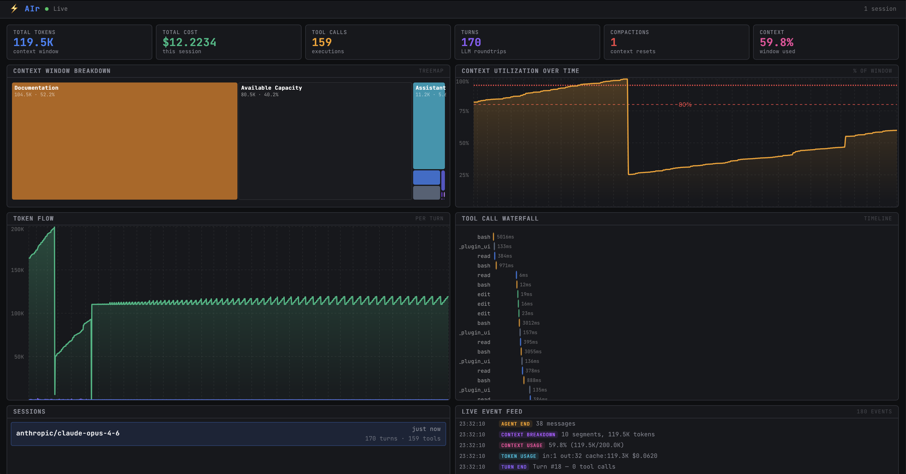

# Hydrotik

A TypeScript monorepo housing a design system, component preview apps, AI observability tooling, and shared infrastructure.

Built with **React 19**, **vanilla-extract**, **Radix UI**, **Turborepo**, and **pnpm workspaces**.

---

## Packages

### Design System

| Package | Path | Description |
|---------|------|-------------|
| [`@hydrotik/design-system`](packages/hy-design-system) | `packages/hy-design-system` | 40+ accessible components built on Radix UI + vanilla-extract. Dark-theme-first, token-driven. |
| [`@hydrotik/tokens`](packages/hy-tokens) | `packages/hy-tokens` | Design token contract — color, typography, spacing, shadows, radii, motion, z-index. |
| [`@hydrotik/theme-provider`](packages/hy-theme-provider) | `packages/hy-theme-provider` | React context provider for theme switching (dark/light). |

### AI & Observability

| Package | Path | Description |
|---------|------|-------------|
| [`@hydrotik/air`](packages/hy-ai-rum) | `packages/hy-ai-rum` | ⚡ Real-time AI observability — context windows, tool calls, token costs, compaction. Server + dashboard + SDK. |
| [`@hydrotik/design-mcp`](packages/hy-design-mcp) | `packages/hy-design-mcp` | MCP server exposing design system tokens, conventions, and docs to AI agents. |
| [`@hydrotik/ai-tools`](packages/hy-ai-tools) | `packages/hy-ai-tools` | AI tool utilities. |

### Apps

| App | Path | Port | Description |
|-----|------|------|-------------|
| [`@hydrotik/component-preview`](apps/hy-component-preview) | `apps/hy-component-preview` | 3100 | Vite app showcasing all design system components across 7 themed pages. |
| [`@hydrotik/storybook`](apps/hy-storybook) | `apps/hy-storybook` | 6006 | Storybook for isolated component development and documentation. |
| [`@hydrotik/bff-fastify`](apps/hy-bff-fastify) | `apps/hy-bff-fastify` | 4000 | Backend-for-Frontend API server (Fastify 5, Swagger, Zod). |

### Shared Config

| Package | Description |
|---------|-------------|
| `@hydrotik/config` | Centralized port assignments and cross-project configuration. |
| `@hydrotik/typescript-config` | Shared tsconfig bases (base, react-library, vite-app). |
| `@hydrotik/eslint-config` | Shared ESLint configuration. |
| `@hydrotik/prettify-config` | Shared Prettier configuration. |
| `@hydrotik/jest-config` | Shared Jest configuration. |
| `@hydrotik/component-template` | Scaffolding template for new design system components. |

---

## Quick Start

```bash
# Prerequisites: Node.js ≥20, pnpm ≥9
git clone https://github.com/hydrotik/hydrotik.git
cd hydrotik
pnpm install

# Start the component preview app
pnpm turbo run dev --filter=@hydrotik/component-preview

# Start Storybook
pnpm turbo run dev --filter=@hydrotik/storybook

# Start the AIr observability dashboard
pnpm turbo run dev --filter=@hydrotik/air

# Build everything
pnpm turbo run build

# Typecheck everything
pnpm turbo run typecheck
```

**Always use `pnpm turbo run`** — never `pnpm --filter`. Turbo handles dependency ordering and caching.

---

## Port Map

| Port | Service |
|------|---------|
| 3100 | Component Preview (Vite) |
| 4000 | BFF Fastify |
| 5100 | Design MCP Server |
| 5200 | AIr Server (Fastify + WebSocket + REST API) |
| 5201 | AIr Dashboard (Vite dev) |
| 6006 | Storybook |

Ports are centralized in [`@hydrotik/config`](packages/hy-config/src/ports.ts).

---

## Component Preview Pages

The preview app at `localhost:3100` has 7 routes:

| Route | Description |
|-------|-------------|
| `/` | Enterprise DataGrid as default home |
| `/dashboard` | KPI cards, revenue bar chart, visitors pie, products table |
| `/inventory` | Sidebar nav, KPI cards, area chart, category donut, orders + products |
| `/ecommerce` | Product grid with hover swap, shopping cart, component showcase |
| `/editorial` | High-density data journalism — DataGrids, SegmentedRatingBars, FlagTags, timeline |
| `/plugin` | TectraScope marketing landing page |
| `/datagrid` | Enterprise DataGrid demo with sorting, filtering, pagination |

### Visual Captures

```bash
pnpm capture --route /editorial                            # single route full page
pnpm capture --route /editorial --scroll 2000              # viewport at scroll offset
pnpm capture --route /editorial --element "[role='meter']" # element-level
pnpm capture:all                                           # all routes
```

---

## Design System

### Conventions

- **CSS-in-TypeScript only** — vanilla-extract, no Tailwind
- **Token-first** — all values from `vars.*`, no hardcoded hex/px
- **Dark theme default**
- **React.forwardRef** + `className` prop + `displayName` on every component
- **Opacity via color-mix** — `color-mix(in srgb, ${vars.color.X} N%, transparent)`
- **High-density sizing** — sm=28px, md=32px, lg=40px
- **lucide-react** for icons (re-exported as `Icons`)
- **Barrel exports** from each component directory

### Component Categories

**Layout:** Card, AspectRatio, ScrollArea, Separator  
**Forms:** Input, Textarea, Select, Checkbox, RadioGroup, Switch, Slider, InputGroup  
**Data Display:** DataGrid, Table, Badge, Avatar, FlagTag, SegmentedRatingBar, Price  
**Feedback:** Alert, AlertDialog, Dialog, Toast, Progress, Spinner, Skeleton  
**Navigation:** Breadcrumb, NavigationMenu, Menubar, Tabs, Pagination  
**Overlay:** Popover, HoverCard, Tooltip, DropdownMenu, ContextMenu, Command, Sheet  
**Actions:** Button, Toggle, ToggleGroup, AddToCartButton  
**E-Commerce:** ProductCard, CartItem, ColorSwatch, QuantityPicker  

---

## ⚡ AIr — AI Observability

Real-time monitoring for AI coding agents. Like New Relic, but for your LLM workflow.



**Features:**
- KPI cards — tokens, cost, tool calls, turns, compactions, context %
- Context window treemap — D3 visualization of what fills your context
- Utilization chart — track context fill with 80%/90% warning thresholds
- Token flow — cache read/output/input per turn with compaction sawtooth
- Tool call waterfall — DevTools-style timing for every tool execution
- Live event feed — color-coded real-time event stream

**Standalone install:**

```bash
npm install @hydrotik/air
npx air
# Dashboard at http://localhost:5200
```

**Auto-start:** The pi collector extension automatically starts the AIr server when a coding session begins. Zero manual setup.

See the full [AIr README](packages/hy-ai-rum/README.md) for SDK docs, API reference, and architecture.

---

## Project Structure

```
hydrotik/
├── apps/
│   ├── hy-component-preview/    # Vite app — 7 themed preview pages
│   ├── hy-storybook/            # Storybook — component explorer
│   └── hy-bff-fastify/          # Backend-for-Frontend API
├── packages/
│   ├── hy-design-system/        # 40+ components (Radix + vanilla-extract)
│   ├── hy-tokens/               # Design token contract
│   ├── hy-theme-provider/       # Theme context provider
│   ├── hy-ai-rum/               # ⚡ AIr observability (server + dashboard + SDK)
│   ├── hy-design-mcp/           # MCP server for design system
│   ├── hy-config/               # Shared ports and configuration
│   └── hy-*-config/             # Shared TS, ESLint, Jest, Prettier configs
├── .pi/extensions/              # Pi agent extensions (AIr collector)
├── .planning/                   # GSD project planning state
├── docs/                        # Architecture docs and reference designs
├── scripts/                     # Visual capture and utility scripts
├── turbo.json                   # Turborepo task configuration
└── pnpm-workspace.yaml          # Workspace definition
```

---

## Tech Stack

| Layer | Technology |
|-------|-----------|
| UI Framework | React 19, Radix UI |
| Styling | vanilla-extract (zero-runtime CSS-in-TS) |
| Tokens | `@hydrotik/tokens` contract — dark/light themes |
| Build | Turborepo, Vite 6, tsdown, tsup |
| Testing | Jest 30, Testing Library, Playwright (E2E) |
| Backend | Fastify 5, Zod validation |
| AI Observability | Fastify + WebSocket + SQLite + D3 + Recharts |
| MCP | `@modelcontextprotocol/sdk` |
| Package Manager | pnpm 9+ (workspaces) |
| Runtime | Node.js ≥20 |

---

## Scripts

```bash
pnpm turbo run build                                       # build all packages
pnpm turbo run build --filter=@hydrotik/design-system      # build one package
pnpm turbo run dev --filter=@hydrotik/component-preview    # dev server
pnpm turbo run typecheck                                   # typecheck all
pnpm turbo run test --filter=@hydrotik/design-system       # run tests
pnpm capture --route /editorial                            # visual capture
pnpm capture:all                                           # capture all routes
```

---

## License

MIT
